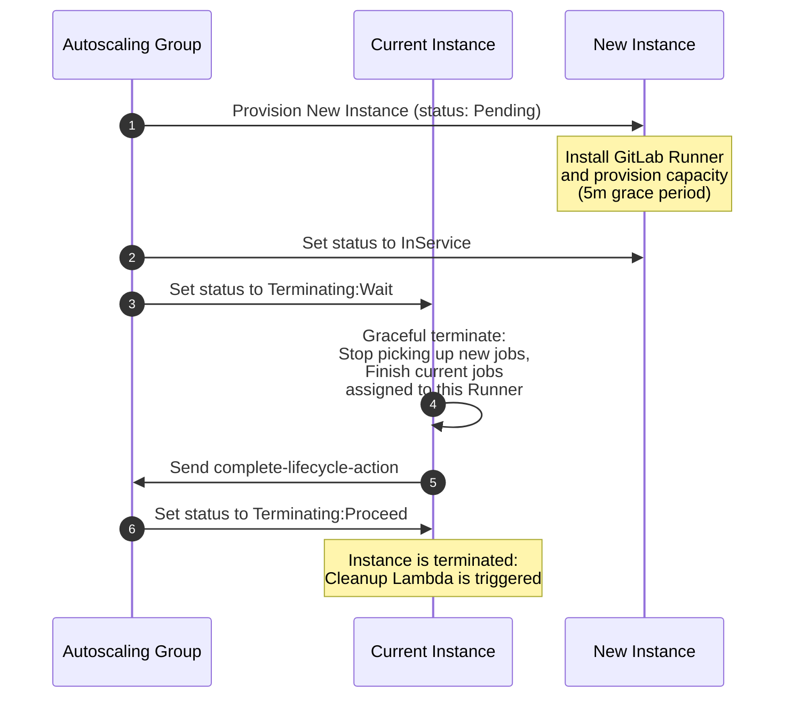

# Usage

Common pitfalls are documented in [pitfalls.md](pitfalls.md).

## Configuration

The examples are configured with defaults that should work in general. The examples are in general configured for the
region Ireland `eu-west-1`. The only parameter that needs to be provided is the name of a SSM parameter holding the Runner
registration token and the URL of your GitLab instance. The Runner token is created in GitLab during the Runner registration process.
Create a file `terraform.tfvars` and put the Runner registration token in the SSM parameter.

```hcl
preregistered_runner_token_ssm_parameter_name = "my-gitlab-runner-token-ssm-parameter-name"
gitlab_url   = "https://my.gitlab.instance/"
```

The base image used to host the GitLab Runner agent is the latest available Amazon Linux 2 HVM EBS AMI. In previous versions of
this module a hard coded list of AMIs per region was provided. This list has been replaced by a search filter to find the latest
AMI. Setting the filter to `amzn2-ami-hvm-2.0.20200207.1-x86_64-ebs` will allow you to version lock the target AMI if needed.

The Runner uses a token to register with GitLab. This token is stored in the AWS SSM parameter store. The token has to be created
manually in GitLab and stored in the SSM parameter store. All other registration methods are deprecated and will be removed in
v8.0.0.

## Install the module

Run `terraform init` to initialize Terraform. Next you can run `terraform plan` to inspect the resources that will be created.

To create the runner, run:

```sh
terraform apply
```

To destroy the runner, run:

```sh
terraform destroy
```

## Scenarios

### Scenario: Basic usage

Below is a basic examples of usages of the module if your GitLab instance version is >= 16.0.0.

```hcl
module "runner" {
  # https://registry.terraform.io/modules/cattle-ops/gitlab-runner/aws/
  source  = "cattle-ops/gitlab-runner/aws"

  aws_region  = "eu-west-1"
  environment = "spot-runners"

  vpc_id    = module.vpc.vpc_id
  subnet_id = element(module.vpc.private_subnets, 0)

  runner_instance = {
    name       = "docker-default"
  }

  runner_gitlab = {
    url = "https://gitlab.com"

    preregistered_runner_token_ssm_parameter_name = "my-gitlab-runner-token-ssm-parameter-name"
  }
}
```

### Scenario: Multi-region deployment

Name clashes due to multi-region deployments for global AWS resources create by this module (IAM, S3) can be avoided by including a
distinguishing region specific prefix via the _cache_bucket_prefix_ string respectively via _name_iam_objects_ in the _overrides_
map. A simple example for this would be to set _region-specific-prefix_ to the AWS region the module is deployed to.

```hcl
module "runner" {
  # https://registry.terraform.io/modules/cattle-ops/gitlab-runner/aws/
  source  = "cattle-ops/gitlab-runner/aws"

  environment = "multi-region-1"
  iam_object_prefix = "<region-specific-prefix>-gitlab-runner-iam"

  vpc_id    = module.vpc.vpc_id
  subnet_id = element(module.vpc.private_subnets, 0)

  runner_gitlab = {
    url = "https://gitlab.com"

    preregistered_runner_token_ssm_parameter_name = "my-gitlab-runner-token-ssm-parameter-name"
  }

   runner_worker_cache = {
     bucket_prefix = "<region-specific-prefix>"
   }

   runner_worker_docker_machine_instance = {
     subnet_ids = module.vpc.private_subnets
   }
}
```

### Scenario: Use of Spot Fleet

Since spot instances can be taken over by AWS depending on the instance type and AZ you are using, you may want multiple instances
types in multiple AZs. This is where spot fleets come in, when there is no capacity on one instance type and one AZ, AWS will take
the next instance type and so on. This update has been possible since the
[fork](https://gitlab.com/cki-project/docker-machine/-/tree/v0.16.2-gitlab.19-cki.2) of docker-machine supports spot fleets.

We have seen that the [fork](https://gitlab.com/cki-project/docker-machine/-/tree/v0.16.2-gitlab.19-cki.2) of docker-machine this
module is using consume more RAM using spot fleets. For comparison, if you launch 50 machines in the same time, it consumes
~1.2GB of RAM. In our case, we had to change the `instance_type` of the runner from `t3.micro` to `t3.small`.

#### Spot Fleet Configuration

```hcl
module "runner" {
  # https://registry.terraform.io/modules/cattle-ops/gitlab-runner/aws/
  source  = "cattle-ops/gitlab-runner/aws"

  environment = "spot-fleet"

  vpc_id    = module.vpc.vpc_id
  subnet_id = element(module.vpc.private_subnets, 0)

  runner_gitlab = {
    url = "https://gitlab.com"

    preregistered_runner_token_ssm_parameter_name = "my-gitlab-runner-token-ssm-parameter-name"
 }

  runner_worker = {
    type = "docker+machine"
  }

  runner_worker_docker_machine_fleet = {
    enable = true
  }

  runner_worker_docker_machine_instance = {
    types = ["t3a.medium", "t3.medium", "t2.medium"]
    subnet_ids = module.vpc.private_subnets
  }
}
```

### Scenario: Use of Docker autoscaler

As docker machine is no longer maintained by docker, gitlab recently developed docker autoscaler to replace docker machine
(still in beta). An option is available to test it out.

Tested with amazon-linux-2-x86 as runner manager and ubuntu-server-22-lts-x86 for runner worker. The following commands have been
added to the original AMI for the runner worker for the docker-autoscaler to work correctly:

```bash
# Install docker
# Add Docker's official GPG key:
apt-get update
apt-get install -y ca-certificates curl
install -m 0755 -d /etc/apt/keyrings
curl -fsSL https://download.docker.com/linux/ubuntu/gpg -o /etc/apt/keyrings/docker.asc
chmod a+r /etc/apt/keyrings/docker.asc

# Add the repository to Apt sources:
echo \
  "deb [arch=$(dpkg --print-architecture) signed-by=/etc/apt/keyrings/docker.asc] https://download.docker.com/linux/ubuntu \
  $(. /etc/os-release && echo "$VERSION_CODENAME") stable" | \
  tee /etc/apt/sources.list.d/docker.list > /dev/null
apt-get update

apt-get install -y docker-ce docker-ce-cli containerd.io docker-buildx-plugin docker-compose-plugin
usermod -aG docker ubuntu
```

#### Docker Autoscaler Configuration

```hcl
module "runner" {
  # https://registry.terraform.io/modules/cattle-ops/gitlab-runner/aws/
  source  = "cattle-ops/gitlab-runner/aws"

  vpc_id    = module.vpc.vpc_id
  subnet_id = element(module.vpc.private_subnets, 0)

  runner_gitlab = {
    tag_list = "runner_worker"
    type     = "instance"
    url      = "https://gitlab.com"

    preregistered_runner_token_ssm_parameter_name = "my-gitlab-runner-token-ssm-parameter-name"
  }
  
  runner_manager = {
    maximum_concurrent_jobs   = 5
  }

  runner_worker = {
    max_jobs            = 5
    request_concurrency = 5
    type                = "docker_autoscaler"
  }

  runner_worker_docker_autoscaler_asg = {
    on_demand_percentage_above_base_capacity = 0
    enable_mixed_instances_policy            = true
    idle_time                                = 600
    subnet_ids                               = vpc.private_subnets_ids
    types                                    = ["t3a.medium", "t3.medium"]
    volume_type                              = "gp3"
    private_address_only                     = true
    ebs_optimized                            = true
    root_size                                = 40
  }

  runner_worker_docker_autoscaler = {
    connector_config_user = "ubuntu"
  }

}
```

### Scenario: Use of Docker autoscaler with Windows runners

Using the `docker_autoscaler` runner worker type, it makes it possible to also run Windows-based jobs in CI.

This way you can use a Unix-based machine as runner manager, and spin up Windows-based runner workers when needed
to keep costs down.

A few pain-points that needs to be taken into account:

- The private key is necessary in order for the manager to connect to the worker nodes
- The default user has to be changed to `Administrator`
- The path resolver must be changed to Powershell
- The worker nodes must have public IPs
- If the cache is enabled, the cache path must be changed to path valid for Windows
- Privileged mode must be disabled because not available on Windows Docker

All of these points have a more in-depth explanation in [this issue](https://github.com/cattle-ops/terraform-aws-gitlab-runner/issues/1233)
and are taken into account in the example configuration below.

#### Docker Autoscaler with Windows-based runners configuration

```hcl

module "runner" {
  # https://registry.terraform.io/modules/cattle-ops/gitlab-runner/aws/
  source  = "cattle-ops/gitlab-runner/aws"

  vpc_id    = module.vpc.vpc_id
  subnet_id = element(module.vpc.private_subnets, 0)

  runner_instance = {
    name                 = "runner-manager"
    private_address_only = false
  }

  runner_gitlab = {
    tag_list = "runner_worker"
    type     = "instance"
    url      = "https://gitlab.com"

    preregistered_runner_token_ssm_parameter_name = "my-gitlab-runner-token-ssm-parameter-name"
  }

  runner_manager = {
    maximum_concurrent_jobs = 5
  }

  runner_worker = {
    type            = "docker-autoscaler"
    max_jobs        = 5
    use_private_key = true

    environment_variables = [
      "FF_USE_POWERSHELL_PATH_RESOLVER=1"
    ]
  }

  runner_worker_docker_autoscaler = {
    fleeting_plugin_version = "1.0.0"
    connector_config_user   = "Administrator"
  }

  runner_worker_docker_autoscaler_ami_owners = ["self"]
  runner_worker_docker_autoscaler_ami_id     = "<windows-ami-id>"

  runner_worker_docker_autoscaler_asg = {
    types                                    = ["m6a.medium", "m6i.medium"]
    subnet_ids                               = vpc.private_subnets_ids
    enable_mixed_instances_policy            = true
    on_demand_base_capacity                  = 0
    on_demand_percentage_above_base_capacity = 0
    max_growth_rate                          = 10
    spot_allocation_strategy                 = "price-capacity-optimized"
    spot_instance_pools                      = 0
  }

  runner_worker_docker_autoscaler_instance = {
    private_address_only = false
  }

  runner_worker_docker_options = {
    volumes    = ["C:/cache"]
    privileged = false
  }
}
```

#### Windows-based runner AMI configuration example

To build an AMI usable as a Windows-based runner image you can use Packer.

Here is an example configuration that:

- Builds a Windows Server 2022 based AMI
- Sets up WinRM, needed for the runner manager to connect to the runner
- Installs Docker Engine, needed to run Docker-based jobs
- Prefetches the GitLab-runner docker image so that it won't be pulled for every job in case spot instances are used

```hcl
packer {
  required_plugins {
    amazon = {
      version = ">= 1.2.1"
      source  = "github.com/hashicorp/amazon"
    }
  }
}

variable "password" {
  type      = string
  sensitive = true
  default   = "SuperS3cr3t!!!"
}

variable "docker_username" {
  type      = string
  sensitive = true
}

variable "docker_password" {
  type      = string
  sensitive = true
}

locals {
  runner_version = "17.7.0"
  timestamp = regex_replace(timestamp(), "[- TZ:]", "")
}

source "amazon-ebs" "docker" {
  ami_name              = "windows-server-2022-runners-${local.timestamp}"
  force_deregister      = true
  force_delete_snapshot = true
  region                = "eu-west-1"
  ebs_optimized         = true
  encrypt_boot          = true
  instance_type         = "c7a.2xlarge"
  source_ami_filter {
    filters = {
      name                = "Windows_Server-2022-English-Core-Base-*"
      root-device-type    = "ebs"
      virtualization-type = "hvm"
    }
    most_recent = true
    owners      = ["amazon"]
  }
  tags = {
    runner_version = "${local.runner_version}"
  }

  aws_polling {
    delay_seconds = 60
    max_attempts  = 60
  }

  launch_block_device_mappings {
    device_name           = "/dev/sda1"
    volume_size           = 50
    volume_type           = "gp2"
    delete_on_termination = true
  }

  communicator   = "winrm"
  winrm_username = "Administrator"
  winrm_password = "${var.password}"
  winrm_use_ssl  = false
  winrm_insecure = true

  # This user data file sets up winrm and configures it so that the connection
  # from Packer is allowed. Without this file being set, Packer will not
  # connect to the instance.
  user_data = <<-EOT
  <powershell>
  # Set administrator password
  net user Administrator ${var.password}
  wmic useraccount where "name='Administrator'" set PasswordExpires=FALSE

  # First, make sure WinRM can't be connected to
  netsh advfirewall firewall set rule name="Windows Remote Management (HTTP-In)" new enable=yes action=block

  # Delete any existing WinRM listeners
  winrm delete winrm/config/listener?Address=*+Transport=HTTP  2>$Null
  winrm delete winrm/config/listener?Address=*+Transport=HTTPS 2>$Null

  # Disable group policies which block basic authentication and unencrypted login

  Set-ItemProperty -Path HKLM:\Software\Policies\Microsoft\Windows\WinRM\Client -Name AllowBasic -Value 1
  Set-ItemProperty -Path HKLM:\Software\Policies\Microsoft\Windows\WinRM\Client -Name AllowUnencryptedTraffic -Value 1
  Set-ItemProperty -Path HKLM:\Software\Policies\Microsoft\Windows\WinRM\Service -Name AllowBasic -Value 1
  Set-ItemProperty -Path HKLM:\Software\Policies\Microsoft\Windows\WinRM\Service -Name AllowUnencryptedTraffic -Value 1

  # Create a new WinRM listener and configure
  winrm create winrm/config/listener?Address=*+Transport=HTTP
  winrm set winrm/config '@{MaxTimeoutms="7200000"}'
  winrm set winrm/config '@{MaxEnvelopeSizekb="8192"}'
  winrm set winrm/config/winrs '@{MaxMemoryPerShellMB="0"}'
  winrm set winrm/config/winrs '@{MaxProcessesPerShell="0"}'
  winrm set winrm/config/service '@{AllowUnencrypted="true"}'
  winrm set winrm/config/service '@{MaxConcurrentOperationsPerUser="12000"}'
  winrm set winrm/config/service/auth '@{Basic="true"}'
  winrm set winrm/config/client/auth '@{Basic="true"}'

  # Configure UAC to allow privilege elevation in remote shells
  $Key = 'HKLM:\SOFTWARE\Microsoft\Windows\CurrentVersion\Policies\System'
  $Setting = 'LocalAccountTokenFilterPolicy'
  Set-ItemProperty -Path $Key -Name $Setting -Value 1 -Force

  # Configure and restart the WinRM Service; Enable the required firewall exception
  Stop-Service -Name WinRM
  Set-Service -Name WinRM -StartupType Automatic
  netsh advfirewall firewall set rule name="Windows Remote Management (HTTP-In)" new action=allow localip=any remoteip=any
  Start-Service -Name WinRM
  </powershell>
  EOT
}

build {
  sources = ["source.amazon-ebs.docker"]

  provisioner "powershell" {
    inline = [
      "Set-ExecutionPolicy Bypass -Scope Process -Force; [System.Net.ServicePointManager]::SecurityProtocol = [System.Net.ServicePointManager]::SecurityProtocol -bor 3072; iex ((New-Object System.Net.WebClient).DownloadString('https://community.chocolatey.org/install.ps1'))",
    ]
  }

  # install containers feature
  provisioner "powershell" {
    inline = [
      "choco feature enable -n allowGlobalConfirmation",
      "choco install git",
      "choco install Containers Microsoft-Hyper-V --source windowsfeatures",
    ]

    valid_exit_codes = [0, 3010]
  }

  # restart is needed for the containers windows feature
  provisioner "windows-restart" {}

  # install docker-engine
  provisioner "powershell" {
    inline = [
      "choco install docker-engine --version=27.4.1",
    ]
  }

  # Administrator is added to docker-users group, we restart for this to work
  provisioner "windows-restart" {}

  # pre-bake some images to reduce pull time during job execution
  provisioner "powershell" {
    inline = [
      "docker pull mcr.microsoft.com/windows/servercore:ltsc2022",
      "docker pull registry.gitlab.com/gitlab-org/gitlab-runner/gitlab-runner-helper:x86_64-v${local.runner_version}-servercore21H2",
    ]
  }

  provisioner "powershell" {
    inline = [
      "& 'C:\\Program Files\\Amazon\\EC2Launch\\ec2launch.exe' sysprep --shutdown=true --clean=true"
    ]
  }
}
```

## Examples

A few [examples](https://github.com/cattle-ops/terraform-aws-gitlab-runner/tree/main/examples/) are provided. Use the
following steps to deploy. Ensure your AWS and Terraform environment is set up correctly. All commands below should be
run from the `terraform-aws-gitlab-runner/examples/<example-dir>` directory. Don't forget to remove the runners
manually from your Gitlab instance as soon as your are done.

## Concepts

### Service linked roles

The GitLab runner EC2 instance requires the following service linked roles:

- AWSServiceRoleForAutoScaling
- AWSServiceRoleForEC2Spot

By default, the EC2 instance is allowed to create the required roles, but this can be disabled by setting the option
`allow_iam_service_linked_role_creation` to `false`. If disabled you must ensure the roles exist. You can create them manually or
via Terraform.

```hcl
resource "aws_iam_service_linked_role" "spot" {
  aws_service_name = "spot.amazonaws.com"
}

resource "aws_iam_service_linked_role" "autoscaling" {
  aws_service_name = "autoscaling.amazonaws.com"
}
```

### KMS keys

If a KMS key is set via `kms_key_id`, make sure that you also give proper access to the key. Otherwise, you might
get errors, e.g. the build cache can't be decrypted or logging via CloudWatch is not possible. For a CloudWatch
example checkout [kms-policy.json](https://github.com/cattle-ops/terraform-aws-gitlab-runner/blob/main/policies/kms-policy.json)

### Auto Scaling Group - Scheduled scaling

When `runner_schedule_enable=true`, the `runner_schedule_config` block can be used to scale the Auto Scaling group.

Scaling may be defined with one `scale_out_*` scheduled action and/or one `scale_in_*` scheduled action.

For example:

```hcl
module "runner" {
  # ...
  runner_schedule_enable = true
  runner_schedule_config = {
    # Configure optional scale_out scheduled action
    scale_out_recurrence = "0 8 * * 1-5"
    scale_out_count      = 1 # Default for min_size, desired_capacity and max_size
    # Override using: scale_out_min_size, scale_out_desired_capacity, scale_out_max_size

    # Configure optional scale_in scheduled action
    scale_in_recurrence  = "0 18 * * 1-5"
    scale_in_count       = 0 # Default for min_size, desired_capacity and max_size
    # Override using: scale_out_min_size, scale_out_desired_capacity, scale_out_max_size
  }
}
```

### Graceful termination / Zero Downtime deployment

This module supports zero-downtime deployments by following a structured process:

- The new instance is first set to the `pending` state, allowing it to provision both GitLab Runner and its configured capacity.
This process is allocated a maximum of five minutes.
- Once provisioning is complete, a signal is sent to the current instance, setting it to the `terminating:wait` state.
- This signal triggers the monitor_runner.sh systemd service, which sends a SIGQUIT signal to the GitLab Runner process,
initiating a graceful shutdown.
- The maximum allowed time for the shutdown process is defined by the `runner_terminate_ec2_lifecycle_timeout_duration` variable.

The diagram below illustrates this process.



The Auto Scaling Group is configured with a [lifecycle hook](https://docs.aws.amazon.com/autoscaling/ec2/userguide/lifecycle-hooks.html)
that executes a provided Lambda function when the runner is terminated to terminate additional instances that were
provisioned by the Docker Machine executor. a `builds/` directory relative to the root module persists that
contains the packaged Lambda function.

### Instrumenting the Graceful termination Lambda

To instrument the Lambda function, the following steps are required:

```hcl
module "runner" {
  # ...
   runner_terminate_ec2_environment_variables = {
     variable1    = "here"
     variable2    = "are"
     old_handler = "{HANDLER}" # automatically replaced by the correct value
   }
   runner_terminate_ec2_lambda_egress_rules = {
      # ... whatever you need, IPv4/IPv6 port 443 is the default
   }
   runner_terminate_ec2_lambda_handler = "instrumented_handler.from.a.layer"
   runner_terminate_ec2_lambda_layer_arns = ["arn:aws:lambda:us-east-1:123456789012:layer:instrumented_handler:1"]
}
```

### Access the Runner instance

A few option are provided to access the runner instance:

1. Access via the Session Manager (SSM) by setting `runner_worker.ssm_access` to `true`. The policy to allow access via SSM is not
   very restrictive.
2. By setting none of the above, no keys or extra policies will be attached to the instance. You can still configure you own
   policies by attaching them to `runner_role`.

### GitLab runner cache

By default the module creates a cache for the runner in S3. Old objects are automatically removed via a configurable life cycle
policy on the bucket.

Creation of the bucket can be disabled and managed outside this module. A good use case is for sharing the cache across multiple
runners. For this purpose the cache is implemented as a sub module. For more details see the
[cache module](https://github.com/cattle-ops/terraform-aws-gitlab-runner/tree/main/modules/cache). An example implementation of
this use case can be found in the [runner-public](https://github.com/cattle-ops/terraform-aws-gitlab-runner/tree/main/examples/runner-public)
example.

In case you enable the access logging for the S3 cache bucket, you have to add the following statement to your S3 logging bucket
policy.

```json
{
    "Sid": "Allow access logging",
    "Effect": "Allow",
    "Principal": {
        "Service": "logging.s3.amazonaws.com"
    },
    "Action": "s3:PutObject",
    "Resource": "<s3-arn>/*"
}
```

## Removing the module

As the module creates a number of resources during runtime (key pairs and spot instance requests), it needs a special
procedure to remove them.

1. Use the AWS Console to set the desired capacity of all auto-scaling groups to 0. To find the correct ones use the
   `var.environment` as search criteria. Setting the desired capacity to 0 prevents AWS from creating new instances
   which will in turn create new resources.
2. Kill all agent ec2 instances via AWS Console. This triggers a Lambda function in the background which removes
   all resources created during runtime of the EC2 instances.
3. Wait 3 minutes so the Lambda function has enough time to delete the key pairs and spot instance requests.
4. Run a `terraform destroy` or `terraform apply` (depends on your setup) to remove the module.

If you don't follow the above procedure key pairs and spot instance requests might survive the removal and might cause
additional costs. But I have never seen that. You should also be fine by executing step 4 only.
